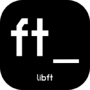
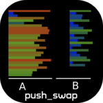

# Hi there, I'm Unai -aka [umartin-][website] 👋

I’m currently studying in [42Urduliz][urduliz_website] 🔭 🇪🇸

## Finished Projects 🚀

## My GitHub Stats 😁

 

## WARNING! 🚨🚫
🇪🇸 Utiliza mis repositorios para comparar tu código o coger ideas, por favor no copies mi código sin aprender porque no te va a servir para nada.

🇬🇧 Use my repositories to compare your code or get ideas, please don't copy my code without learning because it won't help you at all.

[website]: https://profile.intra.42.fr/users/umartin-
[urduliz_website]:https://www.42urduliz.com/
